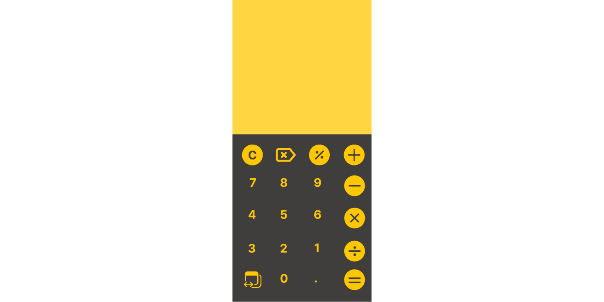

# Calculator

For the UI:

I would like to use this to make it more nice.

I won use all the buttons and will need to simplify it.

Lets also practice with branchs on git.

So the UI came this way and is not exactly as the image before, but hey, it looks good to me right now.

Then I am going to create the functions that make things happen in the display.